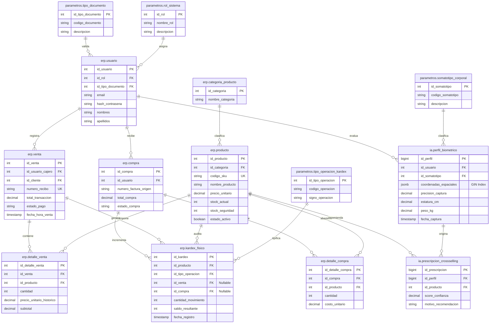
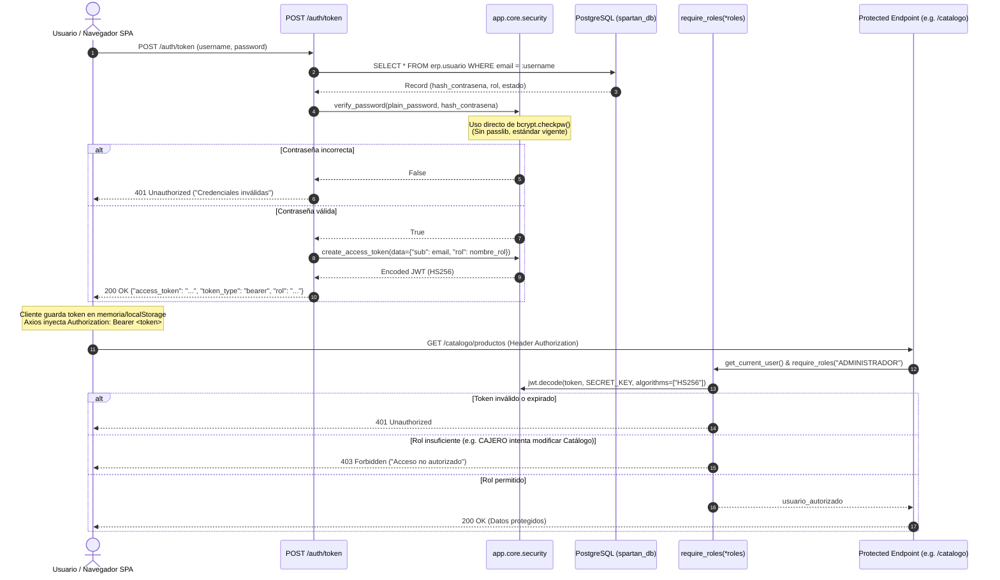

# Diagramas de Arquitectura del Sistema Spartan Suplementos

## 1. Diagrama Entidad-Relación (E/R) Multiesquema (3FN)

```mermaid
erDiagram
    %% ESQUEMA: parametros
    "parametros.rol_sistema" {
        int id_rol PK
        string nombre_rol
        string descripcion
    }
    "parametros.tipo_documento" {
        int id_tipo_documento PK
        string codigo_documento
        string descripcion
    }
    "parametros.tipo_operacion_kardex" {
        int id_tipo_operacion PK
        string codigo_operacion
        string signo_operacion
    }
    "parametros.somatotipo_corporal" {
        int id_somatotipo PK
        string codigo_somatotipo
        string descripcion
    }

    %% ESQUEMA: erp
    "erp.usuario" {
        int id_usuario PK
        int id_rol FK
        int id_tipo_documento FK
        string email
        string hash_contrasena
        string nombres
        string apellidos
    }
    "erp.categoria_producto" {
        int id_categoria PK
        string nombre_categoria
    }
    "erp.producto" {
        int id_producto PK
        int id_categoria FK
        string codigo_sku UK
        string nombre_producto
        decimal precio_unitario
        int stock_actual
        int stock_seguridad
        boolean estado_activo
    }
    "erp.venta" {
        int id_venta PK
        int id_usuario_cajero FK
        int id_cliente FK
        string numero_recibo UK
        decimal total_transaccion
        string estado_pago
        timestamp fecha_hora_venta
    }
    "erp.detalle_venta" {
        int id_detalle_venta PK
        int id_venta FK
        int id_producto FK
        int cantidad
        decimal precio_unitario_historico
        decimal subtotal
    }
    "erp.compra" {
        int id_compra PK
        int id_usuario FK
        string numero_factura_origen
        decimal total_compra
        string estado_compra
    }
    "erp.detalle_compra" {
        int id_detalle_compra PK
        int id_compra FK
        int id_producto FK
        int cantidad
        decimal costo_unitario
    }
    "erp.kardex_fisico" {
        int id_kardex PK
        int id_producto FK
        int id_tipo_operacion FK
        int id_venta FK "Nullable"
        int id_compra FK "Nullable"
        int cantidad_movimiento
        int saldo_resultante
        timestamp fecha_registro
    }

    %% ESQUEMA: ia
    "ia.perfil_biometrico" {
        bigint id_perfil PK
        int id_usuario FK
        int id_somatotipo FK
        jsonb coordenadas_espaciales "GIN Index"
        decimal precision_captura
        decimal estatura_cm
        decimal peso_kg
        timestamp fecha_captura
    }
    "ia.prescripcion_crossselling" {
        bigint id_prescripcion PK
        bigint id_perfil FK
        int id_producto FK
        decimal score_confianza
        string motivo_recomendacion
    }

    %% RELACIONES
    "parametros.rol_sistema" ||--o{ "erp.usuario" : asigna
    "parametros.tipo_documento" ||--o{ "erp.usuario" : valida
    "parametros.tipo_operacion_kardex" ||--o{ "erp.kardex_fisico" : tipifica
    "parametros.somatotipo_corporal" ||--o{ "ia.perfil_biometrico" : clasifica

    "erp.usuario" ||--o{ "erp.venta" : registra
    "erp.usuario" ||--o{ "erp.compra" : recibe
    "erp.categoria_producto" ||--o{ "erp.producto" : clasifica
    "erp.producto" ||--o{ "erp.detalle_venta" : compone
    "erp.producto" ||--o{ "erp.detalle_compra" : abastece
    "erp.producto" ||--o{ "erp.kardex_fisico" : audita
    "erp.venta" ||--o{ "erp.detalle_venta" : contiene
    "erp.compra" ||--o{ "erp.detalle_compra" : contiene
    "erp.venta" ||--o{ "erp.kardex_fisico" : genera
    "erp.compra" ||--o{ "erp.kardex_fisico" : incrementa

    "erp.usuario" ||--o{ "ia.perfil_biometrico" : evalua
    "ia.perfil_biometrico" ||--o{ "ia.prescripcion_crossselling" : origina
    "erp.producto" ||--o{ "ia.prescripcion_crossselling" : recomienda
```

---

## 2. Diagrama de Seguridad y Autorización (OAuth2 / JWT / RBAC)

```mermaid
sequenceDiagram
    autonumber
    actor Cliente as Usuario / Navegador SPA
    participant Router as POST /auth/token
    participant Security as app.core.security
    participant DB as PostgreSQL (spartan_db)
    participant Dependency as require_roles(*roles)
    participant Endpoint as Protected Endpoint (e.g. /catalogo)

    Cliente->>Router: POST /auth/token (username, password)
    Router->>DB: SELECT * FROM erp.usuario WHERE email = :username
    DB-->>Router: Record (hash_contrasena, rol, estado)
    Router->>Security: verify_password(plain_password, hash_contrasena)
    Note over Security: Uso directo de bcrypt.checkpw()<br/>(Sin passlib, estándar vigente)
    
    alt Contraseña incorrecta
        Security-->>Router: False
        Router-->>Cliente: 401 Unauthorized ("Credenciales inválidas")
    else Contraseña válida
        Security-->>Router: True
        Router->>Security: create_access_token(data={"sub": email, "rol": nombre_rol})
        Security-->>Router: Encoded JWT (HS256)
        Router-->>Cliente: 200 OK {"access_token": "...", "token_type": "bearer", "rol": "..."}
    end

    Note over Cliente: Cliente guarda token en memoria/localStorage<br/>Axios inyecta Authorization: Bearer <token>

    Cliente->>Endpoint: GET /catalogo/productos (Header Authorization)
    Endpoint->>Dependency: get_current_user() & require_roles("ADMINISTRADOR")
    Dependency->>Security: jwt.decode(token, SECRET_KEY, algorithms=["HS256"])
    
    alt Token inválido o expirado
        Dependency-->>Cliente: 401 Unauthorized
    else Rol insuficiente (e.g. CAJERO intenta modificar Catálogo)
        Dependency-->>Cliente: 403 Forbidden ("Acceso no autorizado")
    else Rol permitido
        Dependency-->>Endpoint: usuario_autorizado
        Endpoint-->>Cliente: 200 OK (Datos protegidos)
    end
```
